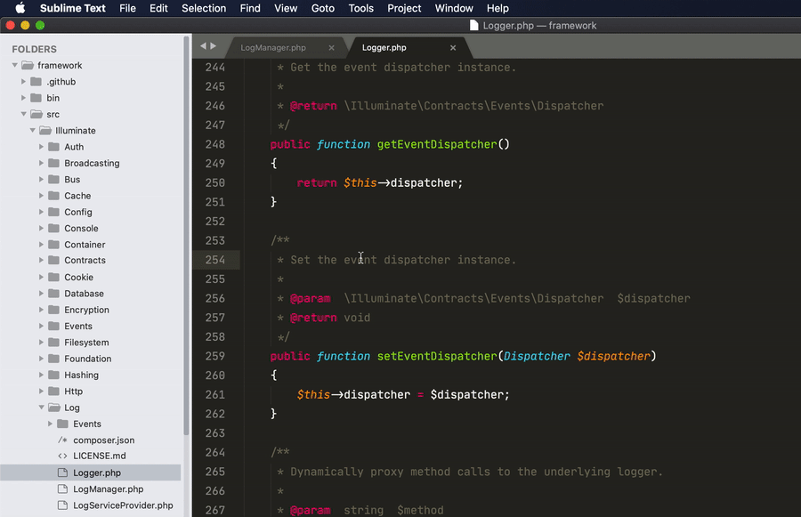

# Open git repos in browser directly from Sublime Text

This lightweight plugin was created as I often need to point out specific spots in repos to other people, bookmark them for future use for myself etc. Instead of opening repo in browser and browsing to necessary file/line manually GitUrl plugin allows to do it directly from Sublime Text automatically.

GitHub, Bitbucket and GitLab repos are supported out of the box.



## Installation

Clone or install repo into new subdirectory in Sublime Packages directory (Preferences -> Browse Packages)

Linux
```
git clone https://github.com/kurtmoser/sublime-giturl.git ~/.config/sublime-text-3/Packages/giturl
```

Mac
```
git clone https://github.com/kurtmoser/sublime-giturl.git ~/Library/Application\ Support/Sublime\ Text\ 3/Packages/giturl
```

Windows
```
git clone https://github.com/kurtmoser/sublime-giturl.git 'C:\Users\<username>\AppData\Roaming\Sublime Text 3\Packages\giturl'
```

## Configuration

GitUrl supports GitHub, Bitbucket and GitLab repos out of the box. However you can additionally configure your own self-hosted git services by adding new entries to "domains" array in GitUrl settings (Preferences -> Package Settings -> GitUrl -> Settings).

Supported keys for "domains" array entry:
- "url": Default branch url pattern (required)
- "url_commit": Commit url pattern
- "url_branch": Branch url pattern
- "line": Fragment for marking specific line in url
- "line_range": Fragment for marking line range in url

Supported keys for url pattern:
{domain}, {user}, {repo}, {path},  {revision}, {line}, {line_end}

Example configurations:
```
"domains": {
    "mydomain.com": {
        "url": "https://{domain}/{user}/{repo}/blob/{revision}/{path}",
        "line": "#L{line}"
    }
}
```
```
"domains": {
    "mydomain.net": {
        "url": "http://{domain}/projects/{user}/repos/{repo}/browse/{path}",
        "url_commit": "http://{domain}/projects/{user}/repos/{repo}/browse/{path}?at={revision}",
        "url_branch": "http://{domain}/projects/{user}/repos/{repo}/browse/{path}?at=refs/heads/{revision}",
        "line": "#{line}",
        "line_range": "#{line}-{line_end}"
    }
}
```

## Keyboard shortcuts

GitUrl introduces 3 commands:
- "giturl_open_commit": Open url using file's latest commit hash
- "giturl_open_branch": Open url using current branch name
- "giturl_open_default_branch": Open url using default branch name

By default no keyboard shortcuts are assigned to these commands but they can be easily added via Sublime key bindings settings (Preferences -> Key Bindings) as follows:
```
[
    ...
    { "keys": ["ctrl+alt+z"], "command": "giturl_open_commit" },
    { "keys": ["ctrl+alt+x"], "command": "giturl_open_branch" },
    { "keys": ["ctrl+alt+c"], "command": "giturl_open_default_branch" },
]
```
